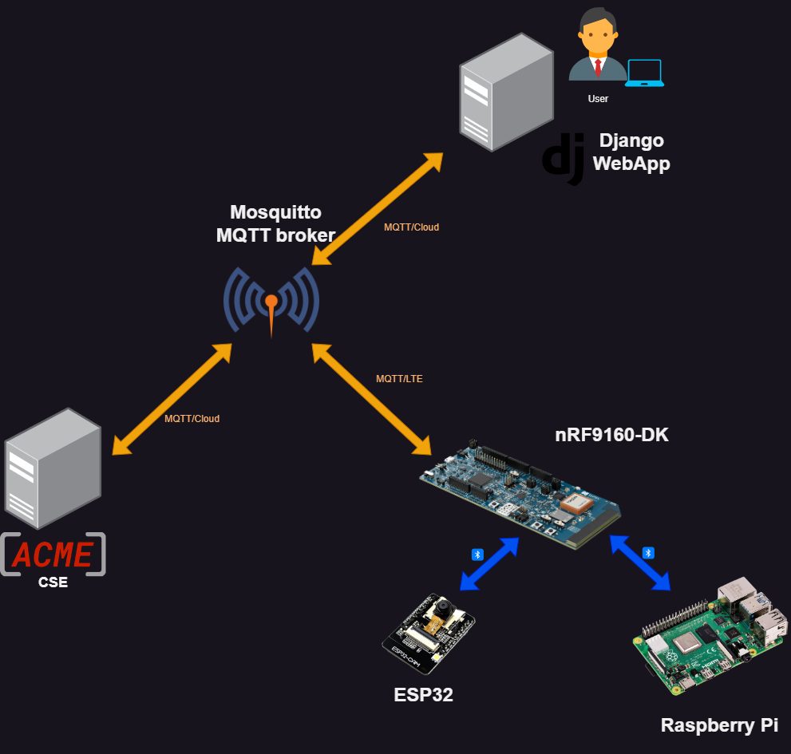

# oneM2M Cellular Device Management using the nRF9160DK as an IPE
Pennsylvania State University CMPEN482W CAPSTONE FALL 2023 Code Repository.

Sponsored by [Exacta Global Smart Solutions](https://www.exactagss.com/), a leading-edge consulting firm for oneM2M and standards-based IoT Solutions based in the Greater Philadelphia Area.

## Documentation 
- [oneM2M Protocol](docs/oneM2M.md) 
- Device Firmware 
	- [Firmware on the 9160DK](9160dk/readme.md) 
	 - [Firmware on the ESP32](ESP32/readme.md) 
	 - [Software on the Raspberry Pi](RPi/readme.md) 
 - Firmware Update 
	 - [Firmware Update Procedure](docs/firmwareUpdate.md) 
		 - [Updating the 9160DK](docs/9160Update.md) 
		 - [Updating the ESP32](docs/ESP32Update.md) 
		 - [Updating the Raspberry Pi](docs/RpiUpdate.md) 
 - [BLE Communication](docs/Bluetooth.md)
 - [MQTT Communication](docs/MQTT.md) 
 - [Final Demo](docs/demo.md)

## Overview

This repository contains code and instructions for implementing cellular-based device management on the ESP32 and the Raspberry Pi through the nRF9160-dk.

*Figure 1: Connectivity Map*

All cloud connections utilize MQTT (Message Queueing Telemetry Transport) for lightweight communication.

All local connections utilize BLE (Bluetooth® Low-Energy) for local lightweight communication.

Firmware updates are overseen and initiated by procedures rooted in ACME and oneM2M but updates do not come from a oneM2M source.

## Components

The following components make up our IoT system:

### nRF-9160DK

The Nordic Semiconductor nRF-9160DK runs three primary features:

- Interworking Proxy Entity
- MQTT/LTE-BLE Connectivity Bridge
- OTA Update on itself

Under oneM2M, an interworking proxy entity connects non-onem2M compliant devices to the oneM2M network. The 9160 does this by polling data over the BLE connection to its child devices, then publishing the data in oneM2M compliant messages to keep the CSE updated. 

To accomplish these tasks, the 9160DK runs an MQTT program over LTE to subscribe to a variety of topics. The 9160DK handles all messages sent to it and determines the next course of action, such as verifying a firmware update for the ESP32 and forwarding it over Bluetooth or responding to a oneM2M message it received from a subscription.

Another layer of connectivity is Bluetooth® Low-Energy. The 9160DK connects multiple devices by running as the BLE Central, connecting to programs advertising the Nordic UART Service (NUS). The 9160 will receive BLE messages and determine the next course of action, such as forwarding a firmware update error to the appropriate MQTT topic or forwarding an image taken by the ESP32 to the Raspberry Pi. However, any BLE capable device running the Nordic UART Service (NUS) *should* be compatible with the project, as long as firmware on these boards are modified for certain conditions (see Firmware Update section).

To keep with the topic of device management, the 9160 also has the ability to run a full firmware over the air (FOTA) update on itself for improved functionality. This is done using MCUBoot.

For more detail, see the [readme on 9160DK](/9160dk/IPE_OTA/readme.md).

### AI-Thinker ESP32-CAM

The AI-Thinker ESP32-CAM is a variant of the EspressIF ESP32 with an onboard camera. The ESP32-CAM acts as an end-device on our network and is not oneM2M compliant. It must interact with the rest of the network through the 9160, which it hosts a BLE connection to.

For demo purposes, the following programs run on the board:

- Upgrade firmware from BLE
- Take image and transmit over BLE

For more detail, see the [readme on ESP32](/ESP32/readme.md).
### Raspberry Pi 4B

The Raspberry Pi 4B is a powerful single-board computer, running a BCM2711 SoC. The Raspberry Pi 4B also acts as an end-device on our network and is not oneM2M compliant. It hosts software onboard to accept software updates to it, but not a full image firmware upgrade.

For demo purposes, four programs run on the board:

- BLE connection to 9160 DK (Accept software and photographs)
- Train Control via GPIO pins
- Reassemble image (photograph) from Bluetooth and show to external monitor
- Image recognition from [Hackster.io](https://www.hackster.io/mjrobot/esp32-cam-tinyml-image-classification-fruits-vs-veggies-4ab970#toc-testing-the-model--inference-9)

For more detail, see the [readme on Raspberry Pi](/RPi/readme.md).
### Django WebApp

The Django WebApp is the user's point of contact with the system. It has the following capabilities:

- MQTT connection to the broker
- oneM2M compliance
- Accepts firmware uploads and chunks them for transmission
- Train control (demo)

### Mosquitto MQTT Broker

The [Eclipse Mosquitto MQTT Broker](https://mosquitto.org/) is an open source MQTT message broker developed by Eclipse. In our network, the broker is deployed on an AWS EC2 instance.

### ACME oneM2M CSE

[ACME oneM2M CSE](https://github.com/ankraft/ACME-oneM2M-CSE) is an open source CSE middleware for education, developed and maintained by Andreas Kraft. In our network, the CSE is deployed on another AWS EC2 instance.

## Acknowledgements

Thank you to [Exacta Global Smart Solutions](https://www.exactagss.com/) for their generous sponsorship and for guiding us through the project. Without their expertise on oneM2M and IoT solutions this project would not have been possible.  

Thank you to Dave Gamble and other contributors for the cJSON library, used extensively in MQTT communications from the 9160 in our project.

Thank you to Andreas Kraft and the other contributors to the ACME CSE. 
