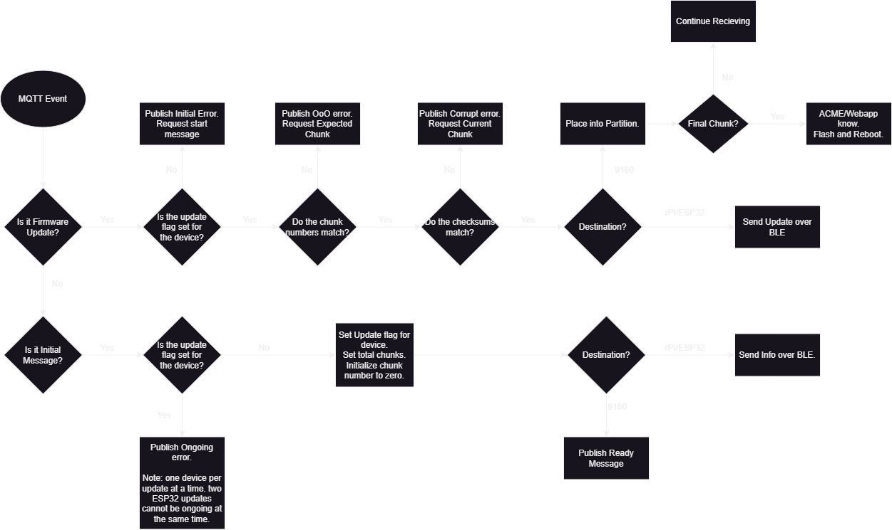

# Update logic on the nRF-9160 DK
## Overview
This page primarily covers how updates are forwarded through the nRF-9160 DK, as well as the logic implemented on the board.  
The following flowchart shows how implemented logic for MQTT firmware updates.

To summarize the chart, the 9160DK will only deal with update chunks once the update flag for a specific board (itself, ESP32 or Raspberry Pi) is set. It will then inspect each firmware by checking the chunk number and the checksum.  
Checksum arrives with the package. By decoding and recalculating the checksum, we can see if the data was modified in any way.  
The checksum algorithm used is CRC32. Although methods with more security exist, they require more computing power and resources, Since security was not considered to be of utmost priority in our project, we decided that CRC32 was sufficient for our project.  

Errors found in the chunks are dealt with immediately by publishing a chunk restart request to the WebApp. Errors found by the downlink devices (ESP32 and Raspberry Pi) are dealt with by the uplink aggregator.  
