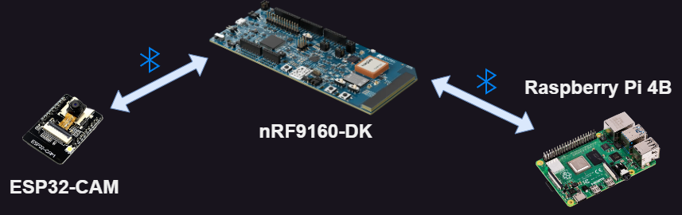

# Bluetooth Low-Energy Communication
All local communication is done using Bluetooth Low-Energy.  
The nRF9160-DK acts as the Bluetooth Central, while the ESP32 and Raspberry Pi act as BLE peripherals.  
The peripherals advertise their data while the central scans for it. Communication is done using the Nordic UART Service (NUS) which emulates UART communication over Bluetooth.  



Nordic UART Service (NUS) emulates UART over BLE. This program builds upon the UART Central Sample to allow multiple connections to the same hub board. Based partially on the [Multi-NUS](https://github.com/NordicMatt/multi-NUS/tree/master) program to manage multiple NUS connections. 

## Headers
In order to sort the messages coming to the 9160DK, a header system was implemented. The one-byte headers for processing are the following:
- 0x01: Firmware Error. Sent if the wrong chunk is received or the checksum fails. This message is forwarded by the 9160DK to MQTT and the appropriate update topic to restart packet sending.
- 0x02: Firmware Ack. This message is sent to the 9160DK to confirm the firmware initialization message. Sent after the device knows how many chunks and total bytes it is going to receive.
- 0x03: Firmware Version. Sends the current firmware version to the 9160DK. 9160DK will use this info to update the ACME.
- 0x04: Image. Not a firmware image, but a photograph. Sent by the ESP32-CAM to the 9160DK. 9160DK will then forward this message/chunk to the Raspberry Pi.
- 0x05: Train Location. This is strictly Demo data. It will be sent to the 9160 and published to the Demo topic to keep the WebApp aware of the train location of fruits and vegetables.

## Code Breakdown
All code is located in [ble.c](../9160dk) to-do: fix link once full release is out.
### Initialization
At initialization, the table mapping device names to connection indexes are cleared to zero. The ctx_lib is also initialized with ```BT_CONN_CTX_DEF(ctx_lib, sizeof(struct bt_nus_client), MAX_CONNECTED_DEVICES);```.
The following are done in this order:
1. Authorization callbacks are registered
2. Authorization info callbacks are registered
3. Enables Bluetooth
4. Initialzes scan
   - Set parameters
   - Initalize the scan (The actual zephyr line)
   - Set filters. Scan by device name, initially set name to ESP32.
   - Enable the scan
   - Set the work to switch the scan (Basically a 10 second timer)
5. Start the scan (actual zephyr line to start)

### Connecting to a device
#### static void connected(struct bt_conn *conn, uint8_t conn_err)
1. Initialize a NUS client for the connection.
   - Create the initial nus client (set parameters for receive and send)
   - Initalize the nus client struct, allocate memory in the ctx_lib.
   - Set the memory in the nus client
   - Initalize the nus client with the parameters.
   - Release the mutex.
2. Exchange MTU
3. Exchange Security
4. Gatt discovery
5. Stop Scan during GATT discovery.
#### gatt_discover()
1. Get the nus client from ctx_lib
2. Start the discovery (zephyr line)
3. Release the mutex
#### discovery_completed()
1. Release the GATT data.
2. Restart the scan.
3. Determine the index of this connection in the ctx_lib, map the index with the name (using the currently scanning name) in a global table (device_maps).
4. Send a ping message to the connected device.

### Disconnecting from a device
#### static void disconnected(struct bt_conn *conn, uint8_t reason)
1. Free the connection from the ctx_lib.
2. Unreference the connection.

### Switching the device to scan for
#### static void switch_device_name(struct k_work *work)
1. Compare the currently scanning device name to "ESP32" or "RaspberryPi". Set a string new_name to the one it is not scanning for (i.e. if current target = ESP32, set new_name to RaspberryPi)
2. strncpy the target name (overwrite it) with the new_name string.
3. Stop the scan.
4. Clear the filter.
5. Add to the filter the new target name.
6. Start the scan.
7. Reschedule this function to execute again 10 seconds later, to swap to the other device.
Potential improvements: Currently, no safeguards are in place from switching between devices during the discovery_completed() function. This could cause problems where a RaspberryPi is discovered 9 seconds into the scan and when discovery is complete, the scan can swap to the ESP32 and have the name incorrectly set.

### Sending a message
#### ble_transmit(const char* target, uint8_t *data, uint16_t length)
This function is called ONLY from mqtt_ble_pipe.c. The target string is calculated there based on the destination parameter from the aggregator.
1. Takes the NUS transmit sempahore
2. Using the "target" input, find the corresponding index from the device_map
3. Using the index, get the corresponding context.
4. Get the corresponding NUS from the context.
5. Transmit using bt_nus_client_send to the correct NUS.
6. Release the context
#### void ble_data_sent(struct bt_nus_client *nus, uint8_t err, const uint8_t *data, uint16_t len)
- gives back the semaphore.

### Receiving a message
#### static uint8_t ble_data_received(struct bt_nus_client *nus, const uint8_t *data, uint16_t len)
1. The message is read and checked for the one-byte header.
2. Based on the header, the packet is placed in the uplink or downlink packet. Most messages are placed in the uplink to be sent over MQTT to the correct topic. If the message is intended for interboard communiation (ESP32 -> Raspberry Pi), it is placed into downlink aggregator instead.
3. Depending on the message type, such as update errors, they are handled immediately.


