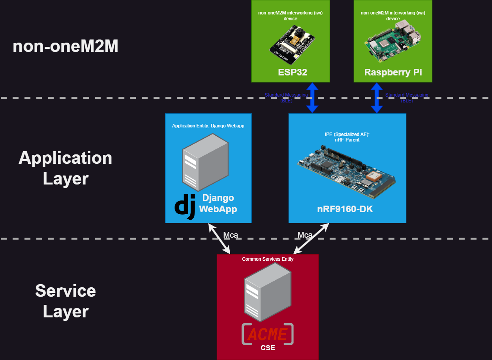
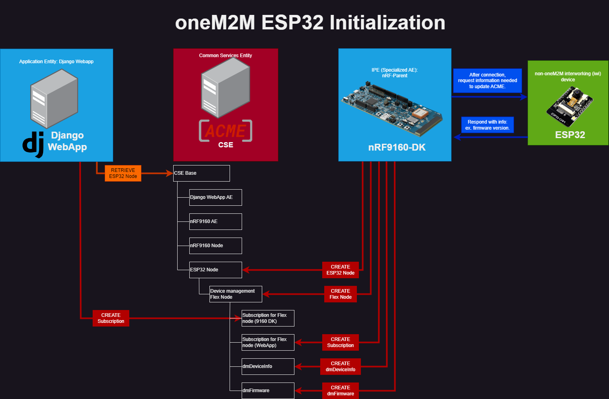
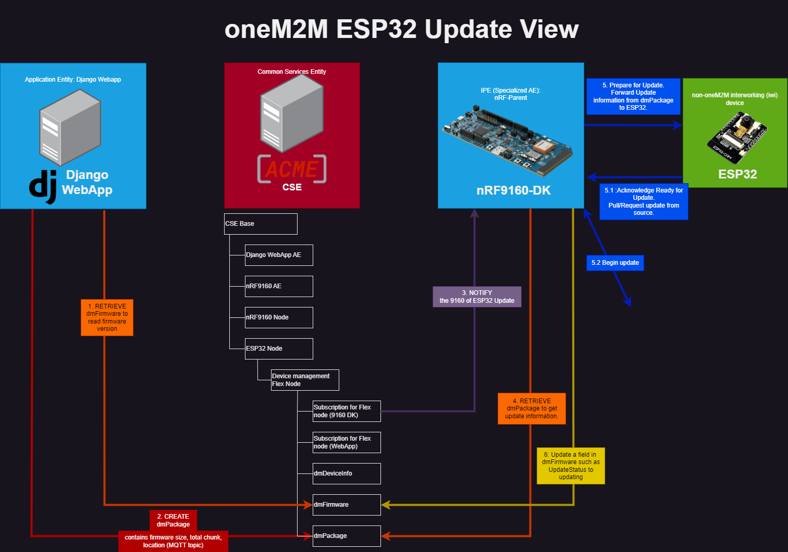
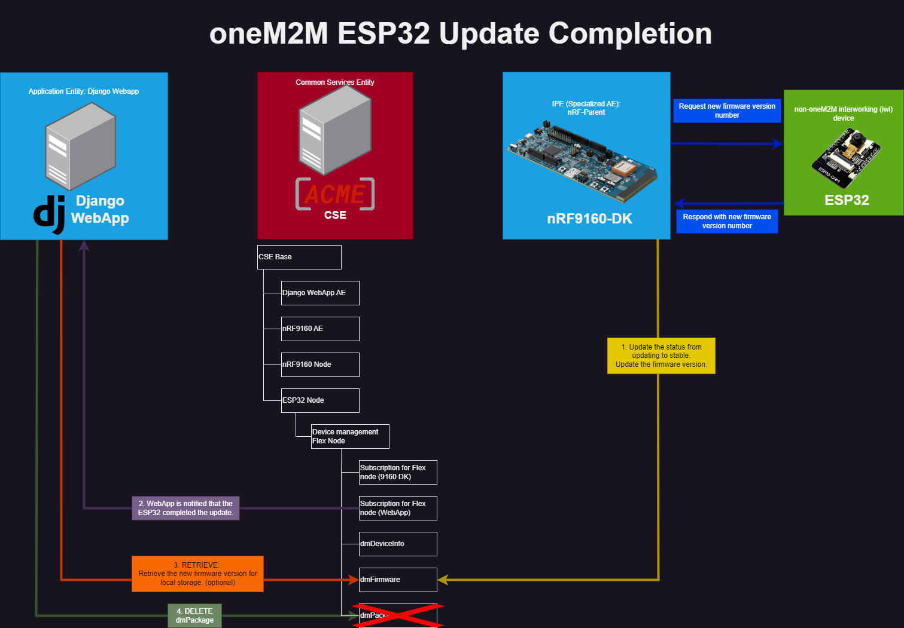

# oneM2M Device Managment
See the official oneM2M website [here](https://www.onem2m.org/) 

oneM2M is a global standard that aims to create a common and interoperable framework for the Internet of Things (IoT) and machine-to-machine (M2M) communications. It provides a standardized and open architecture that enables different IoT and M2M devices and systems to seamlessly communicate and exchange information, regardless of the underlying technology or network.

## High Level Architecture
Our network is comprised of oneM2M devices as well as non-oneM2M devices, linked into the system via an Interworking Proxy Entity (IPE). The nRF-9160DK acts as the IPE, linking two non-oneM2M devices into the system: the Raspberry Pi and ESP32. The oneM2M flowchart is shown in Figure 1.

The oneM2M architecture defines the Mca reference point as the reference point for communication flows between an Application Entity (AE) and a Common Services Entity (CSE). These flows enable the AE to use services supported by the CSE, and for the CSE to communicate with the AE. [^1]
The 9160DK, by being an IPE, can keep the CSE updated on the non-oneM2M devices as well. For an example in our system, the nRF9160-DK updates the ACME CSE on the firmware version for the ESP32. The Django WebApp, an AE, can now access this information on the CSE.

### Application Entities
In oneM2M, Application Entities (AE) are representations of an application. In basic terms, it is a software component that provides or consumes IoT services.
Our system contains two AEs: The Django WebApp and the nRF9160-DK.
#### nRF9160-DK AE
The nRF9160 DK is an IPE, which is a specialized AE capable of communicating with non-oneM2M devices (ESP32 and Raspberry Pi)
#### Django WebApp AE
The Django Webapp is an AE capable of initiating firmware updates. It will do so by updating the resources in ACME for each device.
### Nodes
In oneM2M, Nodes generally represent devices in the system. For example, if an Amazon Web Services EC2 instance was hosting our ACME CSE, the EC2 instance is the Node. 
Our project follows this approach. The Nodes used in our network are the following:
#### Infrastructure Node (IN)
An Infrastructure Node is defined as a Node that contains one CSE and contains zero or more AEs. INs typically serve as the central or code nodes within the oneM2M infrastructure domain. The EC2 Instance hosting the ACME CSE is considered an IN.
#### Application Dedicated Node (ADN)
An Application Dedicated Node is defined as a Node which contains at least one AE but zero CSEs. The sole feature of these nodes are to host AEs, communicating over Mca references with a CSE residing in a MN or in an IN.
Our network has two ADNs: The host system of the Django WebApp (currently locally hosted, plans to move to an EC2 instance) and the nrF-9160 DK.
Although ADNs are typically constrained M2M Devices, since the Django WebApp has no CSE incorporated, it is considered an ADN rather than an ASN (Application Service Node).
#### Non-oneM2M Nodes (NoDN)
A Non-oneM2M Nodes are defined as nodes that do not contain oneM2M Entities. This means that they cannot contain AEs or CSEs. Such Nodes are used to represent devices attached to the oneM2M system for interworking purposes. 
Our system features two significant Non-oneM2M Nodes: the ESP32 and the Raspberry Pi
## Resource Types
### Management Objects (mgmtObjs)
Management objects are located in a Flex Node under each Node for each device. You can think of the layout as a file directory.
Resources used for device management in our system are the following.
- **dmDeviceInfo**: Contains information about the device, such as manufacturer, model, firmware version.
- **dmFirmware**: Manages firmware-related information, including available updates and update status.
- **dmSoftware**: Manages software applications on the device, detailing installed applications and updates.
- **dmPackage**: Deals with software or firmware packages, managing installation and updates.
- **dmAgent**: Represents a management agent on the device, overseeing management operations.
- **dmAreaNwInfo (dmAreaMcInfo)**: Manages network configuration information for the device's area network.
## Information Flows
This document does not specify all data contained in each message. Please refer to the oneM2M Technical Specification [^2] for such information.

AEs or other entities can modify and access information pertaining to device management through standard CRUD (Create, Read, Update, Delete) operations. This involves sending requests to the CSE in our system, which hosts all of our resources. All operations are outlined in this area.
### CREATE
An originator requests to create a resource by using the CREATE method. For example, when the ESP32 initially connects to the 9160 DK, the 9160 DK will send a CREATE call to the ACME CSE to register a NoDN node for the ESP32.
Examples of CREATE operations:
- All AE registrations
- Node registrations from 9160 DK
#### Note on subscriptions:
oneM2M subscriptions are formed via a CREATE message. The nRF9160DK and Django WebApp AEs are both subscribed to the device management attributes for all devices. This is done for real-time, responsive updates. For example, the nRF9160-DK is notified immediately after the WebApp uploads new firmware and the WebApp is notified immediately when an update is complete. 
### RETRIEVE
An originator uses the RETRIEVE operation to request information about a resource. For instance, the Django WebApp might retrieve the current firmware version from `dmDeviceInfo` before initiating an update. Examples of RETRIEVE operations:

- Django WebApp checks firmware version in `dmDeviceInfo`.
- nRF9160 DK retrieves device update info from `dmPackage`.
### UPDATE
The UPDATE operation is used to modify the state or content of a resource. This is frequently used after an action, like a firmware update, to reflect the new state of the device. Examples of UPDATE operations:
- nRF9160 DK updates `dmFirmware` after successfully completing a firmware update on the ESP32.
- Django WebApp updates subscription parameters or device information.
### DELETE

DELETE is used to remove a resource from the system. This might be less frequent but is essential for maintaining the accuracy and relevance of the resource tree. Examples of DELETE operations:

- Removal of a subscription if it's no longer needed (not plans to implement curently)
- Deleting a Node or AE resource when a device is disconnected from the system.
## ESP32 Example
This example will walk through our process when connecting a new device and updating said device. We will be using the ESP32 in our case. 
The following figure shows the oneM2M communication flows:

-  CREATE calls are shown in RED.
-  RETRIEVE calls are shown in ORANGE.
-  UPDATE calls are shown in YELLOW.
-  DELETE calls are shown in GREEN.
-  Non-oneM2M Messages are shown in BLUE
-  Messages sent from subscriptions are shown in PURPLE
**Please Note**: No responses from ACME are shown for clarity. 
### Initialization
The following figure shows the calls when a new device (ESP32) is connected to the nRF9160-DK.

In initialization of a device, nearly all calls are CREATE calls. the 9160DK must create the NoDN node for the ESP32, the flex container for device management attributes and add resources for each attribute sequentially.
In our system, the Django WebApp periodically polls the ACME CSE to determine when a Node has been created.
### Firmware Update

Upon the user uploading new firmware to the Django WebApp, the update (or reversion, depending on the version difference) process is initiated. This process begins with the Django WebApp performing a RETRIEVE operation on the `dmFirmware` resource to attain the current firmware version running on the ESP32. Subsequently, the update is triggered via a user interface button within the Django WebApp in the Demo. Triggering this update results in the creation of a `dmPackage` resource within the ESP32’s Device Management Flex Node. This `dmPackage` includes critical update details such as the MQTT topic, firmware size, and the total number of chunks.
The 9160DK, being subscribed to the Flex Node, will get notified of this and RETRIEVE the information from `dmPackage`. It will then forward this information in a standard message to the ESP32 to prepare for an update. 

Being subscribed to the Flex Node, the nRF9160 DK is immediately notified of the `dmPackage` creation. It responds by retrieving the detailed information from the `dmPackage` and then relays this data in a standardized message format to the ESP32, thereby preparing it for the impending update.

Once the ESP32 acknowledges readiness for the update, the nRF9160 DK proceeds to update the `dmFirmware` status to "updating" for the ESP32 Node. The specifics of the actual firmware update process are detailed comprehensively in the [firmware update documentation](firmwareUpdate.md) and the [ESP32 firmware documentation](ESP32Update.md). However, since these procedures are not directly related to the oneM2M specifications, they are not elaborated here.
### Firmware Update Completion

Finally, when the update is completed, the ESP32 will re-connect to the nRF-9160 DK. The 9160DK will then collect information needed about the new firmware, similar to Initialization. The 9160DK will then update the `dmFirmware` field with the relevant information such as the new version number and switch its state from Updating to Stable.

The Django, being subscribed to the Flex Container, will see these updates. It will get this information (either through a retrieve or the subscription) and update local variables. The Django will also DELETE the dmPackage, as it is no longer needed.

## References
[^1]: oneM2M Basics from [oneM2M Basics](https://onem2m.org/using-onem2m/developers/basics)
[^2]:oneM2M Technical specification [TS-0001-V3.15.1](https://www.onem2m.org/images/files/deliverables/Release3/TS-0001-Functional_Architecture-V3_15_1.pdf)
